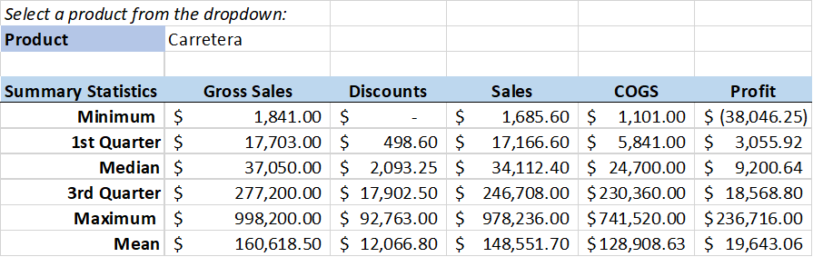
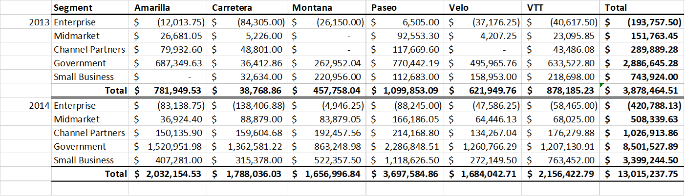
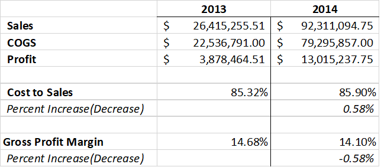
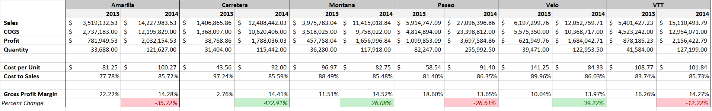
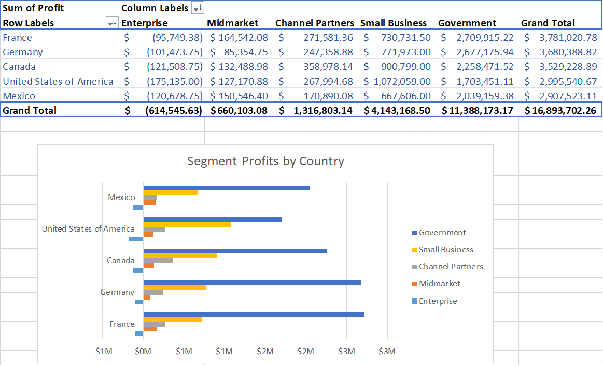
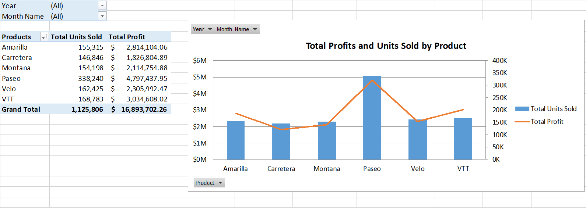
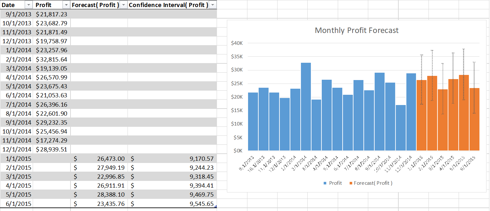

Financial Sample Analysis
================
Leopoldine Mirtil

### Data Source  

This project uses the "Financial Sample" dataset. It was originally downloaded from Power BI for public use 
[link here](https://learn.microsoft.com/en-us/power-bi/create-reports/sample-financial-download)

### Sheet Summaries

#### Product Summary Statistics

A table showing the summary statistics of five financial columns based on the product drop down menu. The drop down menu was created using data validation with a reference sheet. Below is a brief view of the formulas used in the table:

      Minimum:          {=IF(ISBLANK($B$2), "", MIN(IF(financials[Product]=$B$2, financials[Gross Sales])))}
      1st Quarter:      {=IF(ISBLANK($B$2), "", PERCENTILE(IF(financials[Product]=$B$2, financials[Gross Sales]), 0.25))}
      Median:           {=IF(ISBLANK($B$2), "", MEDIAN(IF(financials[Product]=$B$2, financials[Gross Sales])))}
      ...
     

<!-- -->

#### Annual Segment & Product Profit

Created a table showing the annual product profits for each segment. The amounts were calculated using this formula: 

        {=SUMIFS(financials[Profit], financials[Year], $A$2, financials[Segment], $B2,financials[Product],C$1)}

The totals were calculated using SUM.

<!-- -->

#### Ratio Analysis

A table showing the annual total sales, cost of goods sold, profit, cost to sales and gross profit margin. The table also shows the percent difference for each ratio.

Below is a brief view of the formulas used in the table:

      Sales: {=SUMIF(financials[Year],B$1,financials[ [ Sales] ])}
      ...

Below are the basic (non-Excel) formula to calculate the ratios:

      Cost to Sales:         COGS/Sales
      Gross Profit Margin:   Profit/Sales   or   (Sales - COGS)/Sales

The percent difference was calculated by subtracting the 2013 percentage from the 2014 percentage.

<!-- -->

#### Product Ratio Analysis

Created a product table to perform a ratio analysis.  Below is a brief view of the formulas used in the table: 
      
      Sales:        =SUMIFS(financials[ [ Sales] ],financials[Product],$B$1,financials[Year],B$2)
      ...
      Quantity:     =SUMIFS(financials[Units Sold],financials[Product],$B$1,financials[Year],B$2)
      
 And below are the basic (non-Excel) formulas used to calculate the ratios and percent change.

      Cost per Unit:         Quantity/COGS       
      Cost to Sales:         COGS/Sales
      Gross Profit Margin:   Profit/Sales   or   (Sales - COGS)/Sales
      Percent Change:        (2014 Gross Profit Margin - 2013 Gross Profit Margin)/ 2013 Gross Profit Margin

I used conditional formatting to make the positive and negative percent changes stand out in the table.

<!-- -->

#### Segment Profits by Country

A pivot table of the total segment profits for each country, illustrated in a side bar chart.

<!-- -->

#### Product Profits & Units Sold

A pivot table for the total profits and quantity (units sold) of products. A line and bar combination
chart visualizes the table.

<!-- -->

#### Monthly Profit Forecast

A chart showing monthly profit and forecasts for the next six month.  Data tab > Forceast > Forecast 
Sheet. The bar chart visualizes the table, showing the actual monthly profit and the forecasted profit.

					
<!-- -->
